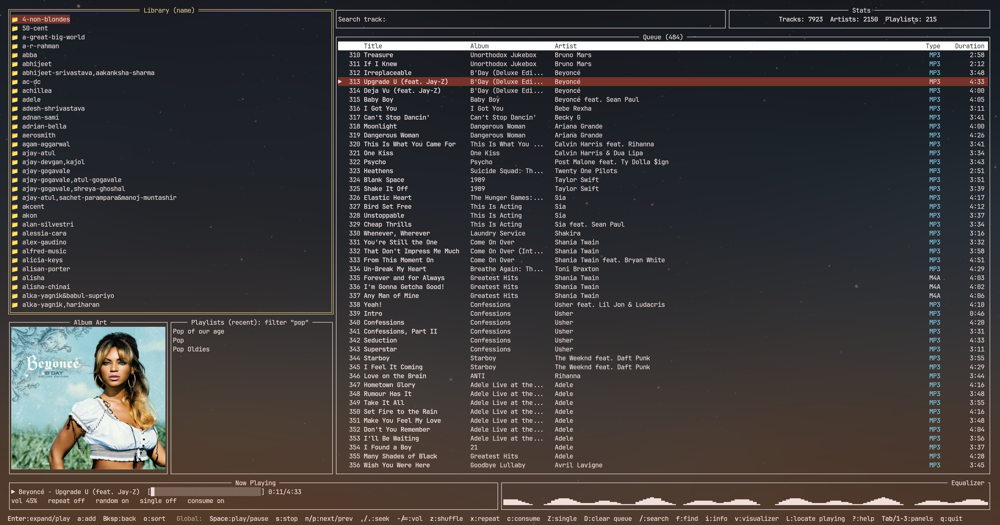
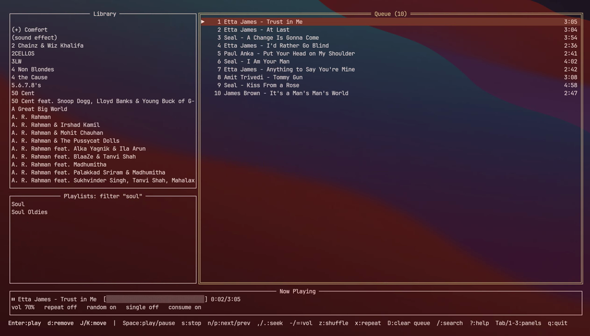

<p align="center">
  
</p>

<h1 align="center">mpdtui</h1>

<p align="center">
  A <a href="https://github.com/jesseduffield/lazygit">lazygit</a>-style terminal UI for
  <a href="https://www.musicpd.org/">MPD</a> (Music Player Daemon).
</p>

<p align="center">
  
  
</p>

---

Bordered panels, single-key contextual actions, vim-style navigation — no
mouse required. Two run modes: a full panel UI, and a lightweight
single-line inline player for a shell or tmux pane.

## Screenshot

<p align="center">
  
</p>

## Demo

<p align="center">
  <a href="https://github.com/susamn/mpdtui/raw/main/assets/demo.webm">
    
  </a>
  <br>
  <sub>Click the screenshot to play the demo (GitHub doesn't inline-render repo video files).</sub>
</p>

## Features

- **Library** — expandable directory tree (MPD's actual filesystem layout,
  lazily loaded per folder), or free-text tag search; `o` cycles
  name/most-recently-modified sort. Search (`/`, and the global `f`
  artist/album/track search) is case- and accent-insensitive, so "bruno"
  matches "Bruno" and "buble" matches "Bublé"
- **Album art** — shown for the currently playing track, updated
  automatically on track change. Renders as a crisp real image via the
  [Kitty graphics protocol](https://sw.kovidgoyal.net/kitty/graphics-protocol/)
  when the terminal supports it (detected from `$TERM` containing
  `kitty`, or `$KITTY_WINDOW_ID` being set -- covers kitty itself and
  kitty-compatible terminals that keep `TERM` as `xterm-kitty`, even if
  it's been overridden to something like `xterm-256color` for remote-host
  terminfo compatibility). Everywhere else -- including terminals that
  *do* support the Kitty protocol but don't signal it either way, e.g.
  some WezTerm/Konsole configurations -- falls back to a fixed 30x15
  ASCII-art rendering; there's no capability probe, since one risks
  hanging against a terminal that never answers it. "No Album Art" is
  shown if MPD has none embedded or alongside the track.
- **Playlists** — a Name/Count table, mirroring the Queue panel's own
  column layout: a pinned header row, Name (🎵 icon prefix, truncated to
  24 characters with "...") on the left, Count right-aligned as the last
  column, populated once fetched and refreshed automatically every 10
  minutes in the background or on demand with `R`. Load, append, save,
  delete stored playlists; `o` cycles between most-recently-updated and
  alphabetical
- **Queue** — reorder, remove, clear, jump to any track; a pinned header
  row (Title/Album/Artist/Year/Genre/Composer/Type/Duration -- plus Lyr,
  see below) stays visible while scrolling. Title is bold and colored
  WhatsApp green; Title/Album/Artist/Genre/Composer are truncated
  (30/20/40/9/14 characters) with "..." if longer; Type shows a
  color-coded format badge (MP3/FLAC/M4A/...); Type and Duration are
  right-aligned. A narrow Lyr column, right after Title, shows a sky-blue
  tick for any track with a matching lyrics file -- only present at all when
  `music_dir` is configured and actually exists; otherwise the Queue
  looks exactly as it would without the lyrics feature -- see
  [Lyrics](#lyrics)
- **Lyrics** (`y`) — a teal-bordered viewer, positioned over the Queue's
  own Year-through-Type columns, for the currently playing track's
  lyrics, read from a `.txt` sidecar file next to the track on disk; see
  [Lyrics](#lyrics) for setup
- **Track metadata** (`1`-`5`, `m`) — local play count, 1-5 star rating,
  and a mark-with-reason flag (e.g. "mark for deletion"), stored in a
  SQLite database separate from MPD's own library; see
  [Track metadata](#track-metadata) for setup
- **Library stats** — live total tracks (green) / artists (sky blue) /
  playlists (cyan), shown alongside the Queue search box, refreshed on
  library/playlist changes; its own border shows the running mpdtui
  version, right-aligned
- **Now Playing bar** — a vibrant play/pause/stop glyph (bright
  green/yellow/red), title (bold WhatsApp green) - artist (bold sky
  blue), live progress (cyan bar), volume (colored along a
  green-to-red gradient by level), repeat/random/single/consume flags
  (bold, green when on/red when off), and the current track's local
  rating and play count (when `track_metadata` is active) -- updated
  instantly via MPD's `idle` protocol (stays in sync even when
  playback changes from another client, e.g. `mpc`); its right half
  shows a small playback-driven visualization (`v` to cycle, currently
  a dancing equalizer scaled by
  actual volume)
- **Lightweight inline mode** (`-mini`) — two live status lines (queue/
  playlist counts, then track/progress), no alt-screen takeover, for
  tmux status panes or a quick glance
- **Fuzzy pickers** (`-p` / `-t`) — fzf-style playlist/track search from
  the shell, no panels involved
- Confirmation prompts on destructive actions (clear queue, delete playlist)

## Install

### Homebrew

```bash
brew tap susamn/mpdtui
brew install mpdtui
```

(First install of a third-party tap: if Homebrew refuses to load the
formula as untrusted, run `brew trust susamn/mpdtui` first.)

### From source

```bash
go build -o mpdtui ./cmd/mpdtui
```

Requires Go 1.26+ and a reachable MPD server.

## Usage

```bash
./mpdtui          # full panel UI
./mpdtui -mini    # lightweight inline player
./mpdtui -p       # fuzzy-search playlists; Enter clears the queue and plays it
./mpdtui -t       # fuzzy-search tracks; Enter adds it to the queue and plays it
```

`-mini`, `-p`, and `-t` are mutually exclusive.

Connects using the same environment variables as `mpc`:

| Variable | Default | Notes |
|---|---|---|
| `MPD_HOST` | `localhost` | may be `password@host` |
| `MPD_PORT` | `6600` | |

Press `?` inside the full UI for the in-app keybinding list.

## Keybindings

**Global** (any panel):

| Key | Action |
|---|---|
| `Space` | Toggle play/pause |
| `s` | Stop |
| `n` / `p` | Next / previous track |
| `,` / `.` | Seek -5s / +5s |
| `-` / `=` | Volume down / up |
| `z` | Toggle random (shuffle) |
| `x` | Toggle repeat |
| `c` | Toggle consume |
| `Z` | Toggle single |
| `D` | Clear entire queue (confirm) |
| `Tab`, `1`/`2`/`3` | Cycle / jump focus between panels |
| `/` | Search (contextual: filters Library/Playlists, jumps to a match in Queue) |
| `f` | Global search from any panel -- type `a`/`al`/`p`/`t` + a term (artist/album/playlist/track); matches appear live as an fzf-style hint list. Up/Down (or Ctrl-P/Ctrl-N) move the highlight while typing; `Tab` (or `f` to return) switches focus to the hint list for `j`/`k`/`g`/`G` navigation, within the popup only. `Enter` acts on the highlight and closes the popup (track adds+plays, playlist loads+plays, artist/album jump into that group in the Library); from the hint list, `a` instead adds without playing (track) or appends (playlist) and leaves the popup open, so several tracks can be queued back-to-back. Stays open with "no X found" if nothing matches |
| `F` | Clear any active search/filter, in every panel at once (Library search, Playlists filter) -- unlike a panel's own `Esc`, works regardless of which panel is currently focused |
| `i` | Track info card for the currently playing track (Track/Album/Artist/Genre/Year), anchored to the bottom-right quarter of the Queue panel |
| `y` | Lyrics viewer for the currently playing track (needs `music_dir` set, see [Lyrics](#lyrics) below) -- `j`/`k`/`g`/`G`/Ctrl-F/Ctrl-B to scroll, `y` or `Esc` to close. Transport controls (`Space`/`s`/`n`/`p`/`,`/`.`/`-`/`=`/`z`/`x`/`c`/`Z`) keep working while it's open |
| `v` | Cycle Now Playing visualizations (right half of the Now Playing bar) |
| `L` | Locate the currently playing track: selects it in the Queue and moves focus there, from any panel, and also reveals it in the Library tree (expanding every folder along its path and selecting it there, without moving focus away from Queue). The Queue-selecting part also happens automatically, whenever the playing track actually changes (explicit play action or natural auto-advance alike) -- except while an overlay is open, or on startup; the Library reveal is only on the explicit keypress |
| `?` | Help overlay |
| `q` | Quit |

**Panel-local**:

| Panel | Key | Action |
|---|---|---|
| Library | `Enter` | Expand/collapse a folder, or add+play a track |
| Library | `a` | Add selected folder (recursively) or track to queue (no play) |
| Library | `Backspace` | Collapse folder, or go up to its parent |
| Library | `j`/`k`/`g`/`G` | Native tree navigation (also `J`/`K` to jump in/out a level) |
| Library | `o` | Cycle sort: name / most recently modified (browse mode only) |
| Library | `Esc` | Clear active search |
| Playlists | `Enter` | Load playlist into queue and play |
| Playlists | `a` | Append playlist to queue |
| Playlists | `d` | Delete playlist (confirm) |
| Playlists | `S` | Save current queue as a new playlist |
| Playlists | `R` | Refresh track counts now (also happens automatically every 10 minutes in the background) |
| Playlists | `o` | Cycle sort: most recently updated / name |
| Playlists | `Esc` | Clear active filter |
| Queue | `Enter` | Play selected track |
| Queue | `d` | Remove selected track |
| Queue | `J` / `K` | Move selected track down / up |
| Queue | `/` | Search: focuses the always-visible "Search track:" box above the queue, Enter jumps to first match (Esc cancels) |
| Queue | `1`-`5` | Rate the selected track 1-5 stars (needs `track_metadata` set, see [Track metadata](#track-metadata) below). Note: this means `1`/`2` no longer jump to Library/Playlists from inside Queue -- `Tab`/`Backtab` still cycle panels regardless of focus |
| Queue | `m` | Mark the selected track with a reason, or clear an existing mark, from a small popup -- `j`/`k`/`g`/`G` to navigate, `Enter` to apply, `Esc` to cancel. Transport controls keep working while it's open |

**Mini mode** (`-mini`): `Space` play/pause, `n`/`p` next/prev, `s` stop,
`-`/`=` volume, `q`/`Ctrl-C` quit.

## Lyrics

Put a `.txt` file next to a track (same directory, e.g. `/a/b/Some
Track [84934].mp3` → `/a/b/Some Track [84934].txt`) and mpdtui will show
it. Matching is normalized rather than exact: special characters are
stripped from both the track's and the `.txt`'s filename before
comparing, so `Some Track [84934].txt` and `some_track-84934.txt` both
match the same track despite differing punctuation.

MPD's own protocol has no command to serve an arbitrary sidecar file's
content (unlike album art, which MPD serves natively), so this requires
mpdtui to read the file directly off disk -- it only works if mpdtui runs
somewhere that can actually see the same files MPD does (typically the
same host, or a mounted/synced path). Point it at the right directory by
creating `~/.config/mpdtui/config` (respects `$XDG_CONFIG_HOME` if set)
with:

```
music_dir = /path/to/your/music
```

(`~/` is expanded.) If the config file doesn't exist, has no `music_dir`
line, or `music_dir` names a path that doesn't actually exist (a typo, a
stale setting, an unmounted drive), the lyrics feature stays inactive:
no Lyr column in the Queue at all (not even an empty one -- the table
looks exactly as it would without this feature), and `y` still opens the
viewer but explains what's missing rather than erroring.

Lyrics availability is rechecked live every time the Queue repopulates
(adding a track, loading/appending a playlist, even another client like
`mpc` changing the queue), not cached from when a track was first added
-- so a `.txt` file dropped in later shows up on the next Queue refresh
without needing to requeue anything.

## Track metadata

Local, per-track bookkeeping -- play count, a 1-5 star rating, and a
"marked with a reason" flag -- that MPD itself has no concept of, kept in
a SQLite database entirely separate from MPD's own library (mpdtui never
writes to anything MPD manages; it only ever adds its own opinions about
a track MPD already reports).

Off by default. Enable it by adding to `~/.config/mpdtui/config` (the
same file `music_dir` lives in):

```
track_metadata = true
```

The database itself lives at `~/.config/mpdtui/mpdtui.db` (next to
`config`, nowhere else) and is created automatically the first time it's
needed.

When active, the Queue table gains three right-aligned columns right
before Type, in this order: **Plays**, **Mark** (a colored tick, blank if
unmarked -- different mark reasons get different tick colors), and
**Rating** (gold stars, filled/unfilled). All database reads/writes
happen in the background -- rating or marking a track flashes its
confirmation immediately, and the relevant column repaints as soon as
the write lands, without ever blocking a keypress on disk I/O.

- **Rating** (`1`-`5`, Queue panel): rates whichever track is currently
  *selected* in the Queue -- not necessarily the one playing.
- **Play count** (**Plays** column): tracked automatically, no
  keybinding. A track counts as played once you've listened to at least
  50% of it (by elapsed/duration, not just "it started"), counted once
  per queue song id so ticking past the halfway point on every refresh,
  or seeking back across it, doesn't inflate the count.
- **Mark** (`m`, Queue panel): opens a small popup listing mark reasons
  (e.g. "mark for deletion") for the selected track, plus a "(clear
  mark)" entry to unmark it. This is bookkeeping only -- mpdtui never
  deletes or moves a file itself, marking one just records your own
  intent for you to act on later.

Tracks are matched by their file path, normalized the same way lyrics
sidecar files are (special characters stripped per path segment,
lowercased) -- so minor path differences don't create duplicate rows, but
each directory still stays distinct (a track named the same as another in
a different folder is still tracked separately).

There's currently no in-app way to edit the mark-reason catalog or the
tag catalog -- add rows to the `mark_reason`/`tags` tables directly (e.g.
via the `sqlite3` CLI against `~/.config/mpdtui/mpdtui.db`) if you want
more than the seeded defaults ("mark for deletion"; "bengali"/"hindi"/
"english" for tags, not yet exposed in the UI).

## Test

```bash
go test ./...
```

`internal/mpdclient` and `internal/ui`'s integration tests need a
reachable MPD server (they skip automatically if there isn't one).

## License

MIT, see [LICENSE](LICENSE).
